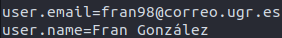

# Uso correcto de Git y GitHub

Una vez descargado git se ha configurado de forma global el nombre y correo para que aparezcan correctamente en los commits. Este es el resultado de la configuración si ejecutamos `$git config --list --global`

En cuanto al uso del par de claves pública/privada ya tenía configurado mi ordenador con una clave SSH subida a GitHub para reconocer y autentificar cualquier operación en mi pc personal. Resumiendo las operaciones a realizar, sería generar el par de claves de la forma usual usando la herramienta *ssh-keygen* y luego subir la clave pública (loquesea.pub) a GitHub.

Para aumentar la seguridad de mi cuenta en GitHub he habilitado el segundo factor de autentificación usando una app de autentificación instalada en mi móvil (en este caso Google Authenticator), por tanto cuando se intente acceder a mi cuenta desde cualquier lado, además de la contraseña es necesario introducir el código generado por esta aplicación (que cambia cada pocos segundos).