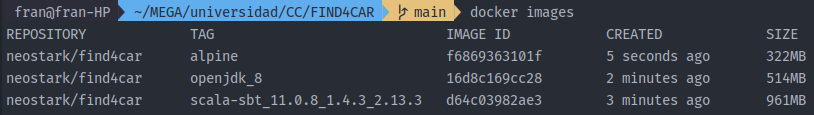
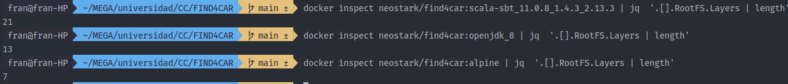
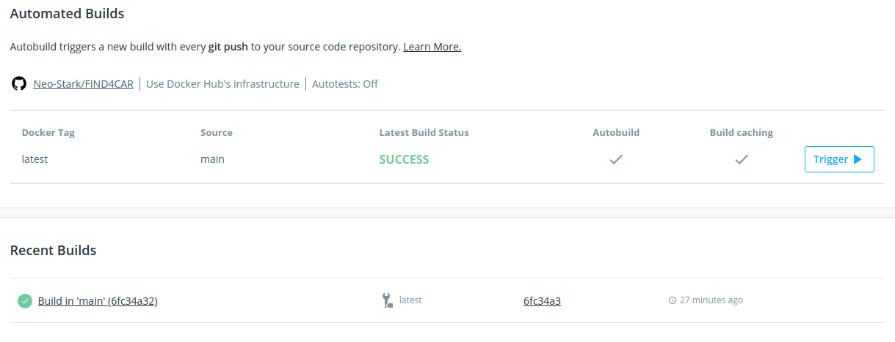

# Contenerizando la aplicación

## Elección de la imagen base

Para la elección de la imagen base se han hecho varias pruebas. El objetivo principal es el de minimizar el tamaño de 
nuestra imagen. En primer lugar, se probó con una imagen que ya venía con scala, sbt y openjdk instalado. Usando esta 
imagen como base nuestro contenedor pesaba cerca de 1GB... Demasiado pesado, por lo que seguimos probando. Luego, se 
probó a partir de una imagen que solo propocionaba el JDK (la imagen oficial que encontramos en docker hub) e instalando
nosotros el resto (sbt y scala). Aquí mejoramos el tamaño llegando a unos 500MB (la mitad), pero sigue siendo bastante.
Por último (siendo esta la elección final), lo que se ha hecho es partir directamente de la imagen base de *alpine* e 
instalando a mano todo lo que necesitamos, de esta manera se ha conseguido reducir el tamaño de la imagen final a **240MB**
(tamaño comprimido mostrado en docker hub), que está bastante bien, teniendo en cuenta que el JDK, scala y sbt pesan bastante.

Las diferencias de tamaño lo podemos ver listando las imágenes y sus tags con la orden `docker images`:


Estas diferencias de tamaño son fácilmente explicables si revisamos el número de capas que tiene cada una, usando 
`docker inspect` y jq para trabajar con el json que genera y contar el número de capas obtenemos los siguientes resultados:
 



## Dockerfile

El Dockerfile finalmente resultante es el siguiente:

```dockerfile
FROM alpine
EXPOSE 8080
ARG SBT_VERSION=1.4.3
ENV SBT_HOME=/usr/local/sbt
VOLUME /app/test /app/app

WORKDIR /app
COPY conf conf
COPY project/build.properties project/plugins.sbt project/
COPY build.sbt .
RUN apk add --no-cache openjdk8 curl bash && mkdir $SBT_HOME && \
    curl -sL https://github.com/sbt/sbt/releases/download/v$SBT_VERSION/sbt-$SBT_VERSION.tgz | \
    tar -xz --strip-components=1 -C $SBT_HOME && ln -s $SBT_HOME/bin/sbt /usr/bin/ && \
    apk del curl && \
    addgroup -S testgroup && adduser -S testuser -G testgroup -s /bin/ash && \
    chown -R testuser .

USER testuser
RUN sbt sbtVersion
CMD ["sbt", "test"]
```

Comentando un poco lo que se hace, en primer lugar elegimos la imagen base (*alpine*). También he aprovechado ya para indicar
que el puerto 8080 es el que vamos a utilizar para conectarnos a nuestro servicio, aunque ahora mismo no nos hace falta, pero
ya está para un futuro. Luego, declaro la versión de sbt y el sitio donde lo vamos a instalar. Además, declaro los dos puntos de montaje que vamos a tener 
en la imagen, en este caso, para los fuentes y los tests (es bien sabido que esta etiqueta no es "necesaria" para montar los volúmenes, pero como indica
la [página de buenas prácticas](https://docs.docker.com/develop/develop-images/dockerfile_best-practices/#volume) de Docker para escribir Dockerfiles, es muy recomendable indicar estas partes de nuestra imagen).
Hecho esto, copio los ficheros de configuración necesarios de la aplicación, se realizan 3 COPY en 3 líneas diferentes porque son
 ficheros que van en directorios de destino diferentes, todos estos ficheros copiados son ficheros de configuración necesarios para
 instalar dependencias, plugins y versiones (así como el build.sbt). A continuación, descargo las herramientas necesarias
 para instalar y ejecutar el programa (curl, bash, sbt y openjdk), una vez instalado sbt borramos curl puesto que no lo vamos
 a necesitar más. Bash lo necesitamos porque el script de sbt usa bash como interprete. Luego creamos un usuario sin privilegios
  para que ejecute los tests y cambiamos los permisos de los ficheros del proyecto para que pueda acceder a ellos. Hay una cosa curiosa
con la última orden y es que el fichero que nos descargamos de sbt es solo un script que nos sirve para "ejecutarlo", pero
realmente no es la herramienta en si, por lo que con la última orden le obligo a ejecutarse y a instalar todos los binarios
necesarios. Si no hicieramos esto, cuando ejecutemos el contenedor tardaría mucho en iniciarse. Por otro lado, la imagen 
pesaría solo 100MB, pero no es rentable por el tiempo que tarda en arrancar. Ya por último declaramos la orden que queremos 
que se ejecute cuando lancemos un contenedor, en este caso, lanzar los tests. Esta orden RUN se ejecuta al final en otra
línea diferente porque sbt instala sus paquetes en el directorio home del usuario por lo que necesitabamos primero instalar
los paquetes con privilegios y luego, crear y cambiar de usuario antes de ejecutar esta orden.

## Docker Hub

La configuración de docker hub para que constuya la imagen cuando hagamos push a nuestro repositorio de GitHub es bastante
sencilla. Solo hay que indicarle el repositorio del que se trata y la rama que queremos que "vigile", en este caso la main.



## Azure Container Registry

El otro registro elegido para almacenar la imagen de la aplicación es el de Azure. Principalmente he elegido este registro
porque en un futuro se desplegará la aplicación en esta plataforma por lo que es muy conveniente tener la imagen directamente
en sus registros, ya que, entre otras cosas, nos va a permitir redesplegar la aplicación automaticamente cuando se produzcan cambios en la 
imagen.

El proceso para subir la imagen a este registro no voy a comentarlo porque es bastante sencillo. Para más información, consultar este
[enlace](https://docs.microsoft.com/es-es/azure/container-registry/container-registry-get-started-azure-cli). Lo que si
me gustaría comentar es la integración con Github para que se actualice automáticamente cuando hagamos cambios en el repositorio.
Para lograrlo, hay que definir una orden para que se lance cuando se produzca alguna actualización. Esta orden se puede reproducir 
con el siguiente comando:
```bash
az acr task create \                                  
--registry cc2021 \
--name build_on_commit \
--image find4car \
--context https://github.com/neo-stark/FIND4CAR.git#main \
--file Dockerfile \
--git-access-token <token-GitHub>
```

Es bastante sencilla como se puede ver, hay que indicarle el registro en el que queremos que se hagan los cambios (podemos 
tener varios), la imagen y el repositorio de donde queremos coger los cambios. Como vemos al final, hay que especificar 
un token de GitHub (no he puesto el que yo he usado por motivos obvios) que se puede generar facilmente [aquí](https://github.com/settings/tokens).

Para descargar la imagen de este registro: `docker pull cc2021.azurecr.io/find4car:latest`