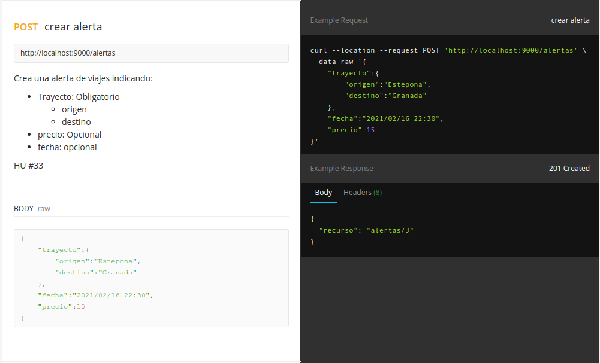

# :cloud: Descripción del microservicio

## Framework elegido :arrow_forward: Play

El framework que se ha elegido para implementar la API REST
ha sido [Playframework](https://www.playframework.com/).
No hace falta dar mucha justificación técnica de la elección de
este framework, puesto que no hay mucho donde elegir realmente es
Play o Play. Es verdad que tenemos otros como Scalatra o Akka HTTP, pero
hay justificaciones por las que no se han elegido estas opciones. Por un lado,
Akka HTTP no se ha elegido, ya que realmente es una API a más bajo nivel y que
el propio framework Play implementa o hace uso de ella (o al menos una parte),
esto hace que su elección sea automáticamente descartada, además de ser más lenta
en comparación porque no escala tan bien como lo hace Play.

Por otro lado tenemos scalatra,
que está muy bien, es rápido, sencillo de utilizar y ligero. Pero tanta
sencillez trae problemas, ya que no implementa algunas funcionalidades que han sido
de muy fácil de trabajar en Play que no son tan potentes en scalatra. Ejemplo de ello
son la extensa libreria de tests y de mocks, las bibliotecas para tratar con el formato Json o 
la integración con sistemas de logs que hacen el trabajo mucho más sencillo.

Así que por lo dicho en estos dos parrafos anteriores y que no hay mucho más donde elegir
finalmente se ha optado por utilizar PlayFramework.

## Diseño de la API

La documentación al completo de la API con todas sus rutas se puede encontrar en el siguiente [enlace](https://documenter.getpostman.com/view/9052678/TWDTNeni) usando la herramienta de Postman.

No voy a comentar mucho más aquí sobre la documentación de la API ya que todo está explicado en el enlace anterior. Un ejemplo de ruta puede ser la siguiente:



Donde se muestra la ruta que se está utilizando, el verbo HTTP, se explica el contenido que debe tener la petición, así como un ejemplo de petición y respuesta de la API con 
sus cabeceras, código de estado y contenido del body.

Hablando ya más de código, en el diseño de la API se ha intentado
separar lo máximo posible la lógica de negocio del propio diseño de la
API y sus diferentes rutas. Todo lo relativo a la API se encuentra en el
paquete _api_.

Por un lado tenemos la clase Router donde se definen las rutas.

```scala
class Router @Inject()(controller: Controller) extends SimpleRouter{
  override def routes: Routes = {
    case GET(p"/") => controller.index
    case GET(p"/viajes") => controller.viajes
    case GET(p"/viajes/buscar") => controller.buscar
    case GET(p"/viajes/buscar/fecha") => controller.buscarFecha
    case GET(p"/viajes/buscar/precio") => controller.buscarPrecio
    case GET(p"/viajes/$id") => controller.viajes(id.toLong)
    case GET(p"/alertas") => controller.alertas
    case GET(p"/alertas/$id") => controller.alertas(id.toLong)
    case POST(p"/alertas") => controller.crearAlerta
    case PUT(p"/alertas/$id") => controller.modificarAlerta(id.toLong)
    case DELETE(p"/alertas/$id") => controller.eliminarAlerta(id.toLong)

  }
}
```

Como vemos se definen todas las rutas de una forma relativamente sencilla indicando el verbo
HTTP asociado, la URI del recurso y el método del controlador asociado. Estos métodos se 
definen en una clase Controller dentro del mismo paquete. Esta clase se encarga de gestionar
la petición y generar una respuesta básicamente. Para ello llama a las clases controladoras de 
cada recurso que son las que realizan el trabajo realmente. No voy a explicar cada método por separado, ya que no tendría mucho sentido tampoco, pero si voy a poner uno como ejemplo para ver
la estructura común que se ha seguido:

```scala
  def modificarAlerta(id: Long): Action[JsValue] = Action(parse.json) { request =>
    val peticion = request.body.validate[Alerta]
    peticion.fold(
      errores => {
        logger.error("modificarAlerta: " + errores)
        BadRequest(Json.obj("errores" -> JsError.toJson(errores)))
      },
      peticionOk => {
        logger.info("modificarAlerta: " + peticionOk)
        if (controladorAlertas.modificarAlerta(id, peticionOk))
          Ok(Json.obj("recurso-modificado" -> peticionOk,
            "id" -> id))
        else NotFound
      }
    )
  }
```

El método sigue los siguientes pasos:

1. Procesa el cuerpo de la petición transformándolo de Json al objeto correspondiente, para ello se ha tenido que crear también una serie de `parsers` que permitan hacer esta transformación, estos están definidos en el objeto `JsonReaders`.
2. Una vez tenemos el cuerpo de la petición tenemos que comprobar si se ha construido correctamente o el Json no era correcto, por lo que se hace un `fold` con esas dos opciones
   1. En caso de error: se devuelve una respuesta BadRequest(400) con los errores encontrados en el cuerpo de la respuesta
   2. En caso de ser correcta: se realiza la acción asociada llamando al método del controlador correspondiente. En función del método y los resultados que pueda generar se devolverá una respuesta u otra. Por ejemplo, en este caso se pretende modificar un recurso alerta, para ello se recibe un id que identifica esa alerta y los nuevos valores de esa alerta. En caso de que se encuentre la alerta asociada a ese id se devolverá una respuesta 200 con el recurso módificado. En caso de no encontrar la alerta con ese id se devolverá un NotFound (404).

Esto ha sido un ejemplo de método de la API, el resto siguen una lógica igual.

## Testeando la API

Para asegurarnos del correcto funcionamiento de la API se ha generado una batería de tests funcionales que podemos encontrar en `/test/FunctionalTests.scala`. Aquí se testean todas las rutas que tiene actualmente la aplicación y se comprueba que los resultados que genera para unos parámetros concretos son los esperados. El fichero tiene cerca de 150 líneas. Aquí un ejemplo de uno de los tests implementados, en este ejemplo se testea la funcionalidad para modificar una alerta que veíamos antes:

```scala
"modificar alerta" in {
    val request = FakeRequest(PUT, "/alertas/1").withHeaders(HOST -> "localhost:9000", CONTENT_TYPE -> JSON).
      withBody(
        """{
          |    "trayecto":{
          |        "origen":"Estepona",
          |        "destino":"Granada"
          |    },
          |    "fecha":"2021/02/16 22:30",
          |    "precio":15
          |}""".stripMargin)
    val response = route(app, request).get
    val body = contentAsJson(response)
    val alertaModificada = (body \ "recurso-modificado").validate[Alerta].get
    alertaModificada mustBe new Alerta(None, Trayecto("Estepona", "Granada"), Some(15), alertaModificada.fecha)
    status(response) mustBe OK
  }
```

Como vemos se genera una "FakeRequest" con la ruta que vamos a testear, el método HTTP, las cabeceras necesarias y el contenido del cuerpo (en este caso los nuevos valores de una alerta). Posteriormente capturamos la respuesta y comprobamos que sea correcta, para ello nos aseguramos que nos devuelve el Json con los datos correctos y que efectivamente el status de la respuesta es 200.

## Sistema de Logs

Como se ha podido comprobar en el ejemplo del controlador hay algunas llamadas a un objeto `logger`, este objeto se trata del sistema de logs dentro de la aplicación. Este es muy sencillo de utilizar y configurar, gracias, en parte, a que está fuertemente integrado en el framework de Play y proporciona muchas facilidades para su uso. Como decía para crear un log hay que definir un objeto (o instancia en scala) de la clase `Logger`, con esto ya tenemos la herramienta para enviar mensajes de log dentro de la aplicación. Estos mensajes tienen una serie de niveles de importancia: `ERROR`, `WARN`, `INFO`, `DEBUG` o `TRACE`. Con esto podemos clasificar y filtrar los mensajes de log en función de su severidad.

Por otro lado, para que esto funcione debemos configurar el sistema de logs como tal. Play usa por defecto el sistema de logs [`LogBack`](http://logback.qos.ch/) que se configura mediante un fichero xml de configuración llamado _logback.xml_

```xml
<configuration>
  <conversionRule conversionWord="coloredLevel" converterClass="play.api.libs.logback.ColoredLevel" />

  <appender name="FILE" class="ch.qos.logback.core.FileAppender">
    <file>${application.home:-.}/logs/application.log</file>
    <encoder>
      <pattern>%date [%level] from %logger in %thread - %message%n%xException</pattern>
    </encoder>
  </appender>

  <appender name="STDOUT" class="ch.qos.logback.core.ConsoleAppender">
    <encoder>
      <pattern>%coloredLevel %logger{15} - %message%n%xException{10}</pattern>
    </encoder>
  </appender>

  <appender name="ASYNCFILE" class="ch.qos.logback.classic.AsyncAppender">
    <appender-ref ref="FILE" />
  </appender>

  <appender name="ASYNCSTDOUT" class="ch.qos.logback.classic.AsyncAppender">
    <appender-ref ref="STDOUT" />
  </appender>

  <root level="DEBUG">
    <appender-ref ref="ASYNCFILE" />
    <appender-ref ref="ASYNCSTDOUT" />
  </root>
</configuration>
```

Describiéndolo rápidamente, tenemos unas etiquetas llamadas _appender_, estas son las encargadas de definir cada tipo de log y hacía donde van dirigidos esos mensajes, así como su formato. Aquí podemos definir si queremos escribirlos en un fichero o sacarlos por pantalla y su formato en cada caso. Una vez definidos los appenders hay una etiqueta _root_ que indica los logs que se van a lanzar cuando la aplicación esté en ejecución. También hay un atributo _level_, esto indica el nivel de importancia con el que se van a tener en cuenta los mensajes de log, es decir, en este caso los mensajes con una importancia por debajo de DEBUG no se mostraran o almacenaran en ningún lado.