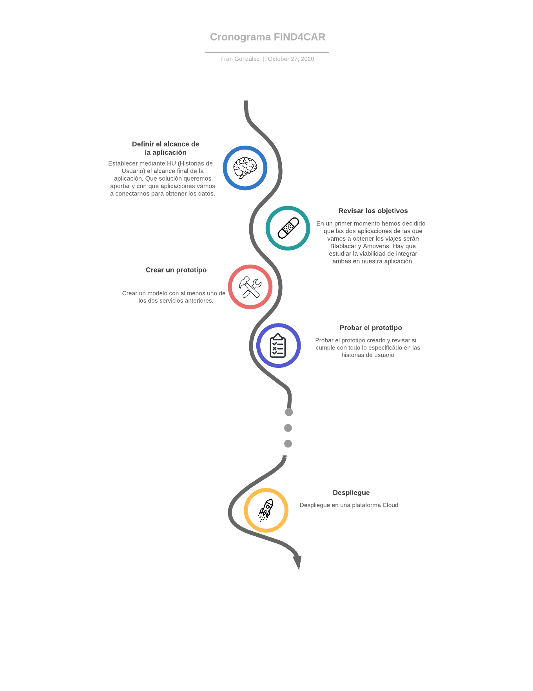

# Planificación

En primer lugar, la primera tarea a realizar es definir la infraestructura de la aplicación. Entiéndase como infraestructura el conjunto de clases y operaciones que definirán la carcasa de nuestra aplicación y que serán solamente eso, carcasas, ya que la propia aplicación no genera viajes, si no que los obtiene de otros servicios como comentaremos ahora y son estos los encargados de rellenar estas carcasas. Esta primera parte viene recogida en el milestone [Infraestructura de la aplicación](https://github.com/Neo-Stark/FIND4CAR/milestone/2) y actualmente recoge dos HU (historias de usuario):

- [#7](https://github.com/Neo-Stark/FIND4CAR/issues/7): Aquí definimos como queremos representar un viaje y la información que queremos obtener y por qué.
- [#9](https://github.com/Neo-Stark/FIND4CAR/issues/9): Aquí se define la entidad conductor y los datos que vamos a representar y por qué.

Los siguientes dos hitos bien podrían ser elaborados en paralelo o ser intercambiable el orden de realización entre ellos ya que sería irrelevante realmente hacer antes uno que otro. En este caso se va a optar por llevar a cabo primero el hito [Conexión con Blablacar](https://github.com/Neo-Stark/FIND4CAR/milestone/3) en el que a grandes rasgos lo que queremos conseguir es conectarnos con este servicio anunciante de viajes compartidos y obtener los viajes públicados previa selección de los parámetros del viaje en nuestro sistema. La [primera HU](https://github.com/Neo-Stark/FIND4CAR/issues/4) de este hito será conectarnos a la API de Blablacar para llevar a cabo estas consultas. Por el otro lado, el otro hito, llamémosle equivalente, es el hito [Conexión con Amovens](https://github.com/Neo-Stark/FIND4CAR/milestone/6) que tiene básicamente el mismo objetivo, pero conectándonos en este caso con la plataforma _Amovens_.

Otro de los hitos será la [contenerización](https://github.com/Neo-Stark/FIND4CAR/milestone/5) de los diferentes componentes de la aplicación. Se irá detallando más conforme avancemos en el proyecto.

Uno de los hitos finales (si no el último) será el [despliegue de la aplicación](https://github.com/Neo-Stark/FIND4CAR/milestone/4) en un servicio Cloud. Se irá detallando más conforme avancemos en el proyecto.

Un cronograma a un nivel más global se presenta en la siguiente imagen:

